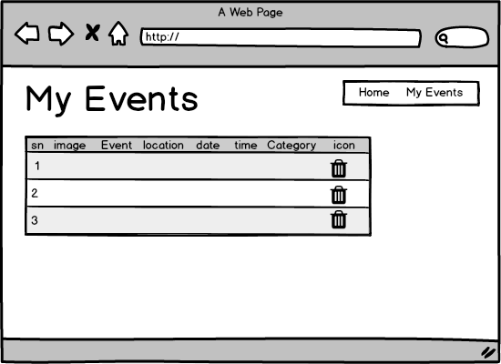
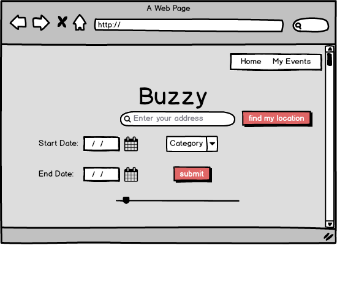

<a name="goback">

# Project 4 Buzzy

## Live: 



</a>

### Esraa Alaarag 

## Table of Contents

1. [App description](#appdescription)
2. [User Stories](#userstories)
3. [Wireframes Web Version](#wireframesweb)
4. [Visual representation of the database](#database)
5. [Pseudocode](#pseudocode)
6. [APP flowChart](#workflow)
7. [ERD or other visual representation of your database](#database)
8. [Technologies used](#technologies)
9. [Live deployment](#project)


<a name="appdescription">

## APP DESCRIPTION:

An app to show user what activities are available around his location or any location around him.

Step 1: The user enters his address or any address or click to let the app finds his location. 

Step 2: The app displays a map with user's location and the surrounding events and their information around that location. 

Step 3: The user can click on save event to save the event that he is interested in.

Step 4: The user can see the saved events in my events page.

#### Post MPV

Step 5:The user can adjust the radius of the area that he wants to find out about.

Step 6:The user can search the events based on the city, date, or Category.

</a>

<a name="userstories">

## USER STORIES:

- As a user, I want the app to get my location without entering it in the app.

- As a user, I want the app to display the events around certain location.

- As a user, I want to be able to adjust the searched area.

- As a user, I want to be able to save the events that I'm interested in.

- As a user, I want to be able to delete the events that I'm no longer interested in.

#### Post MVP
- As a user, I want to be able to search the any city with out specifying the address.

- As a user, I want to be able to search the event based on their category.

- As a user, I want to be able to search the events based on their date.

- As a user, I want to be able to share the events on social media.

<a name="wireframesweb">

## WIREFRAMES:
## (Web/Browser Version)


### Homepage:


### Search Result:


### My Events:


### Post MVP

### Homepage:


### Homepage options:

</a>

<a name="pseudocode">

## PSEUDOCODE:

1. The user enters the address that he wants to find the events in
	or
2. Get the user address automatically
3. Send the address to API to get the events around that area
4. Send the location to Google map API to display the location on the map 
5. If the user clicked “save events” the events will be saved in the database.
6. If the user clicked delete the event will be deleted


<a name="database"> 

## ERD/VISUAL REPRESENTATION OF DATABASE:



</a>

<a name="technologies"> 

## TECHNOLOGIES USED:

### Core Stack:

- Node.js
- Express

- HTML
- CSS
- JavaScript
- jQuery
- Heroku
- Git

### Middleware:

- axios
- Ajax
- react-routers
- CSS Frameworks
- Postgresql

### APIs:

- Google map
- New York times API

### Also

- Trullo
- Balsamiq (wireframes)
- Postman (API and DB testing)

</a>

<a name="project">

## SEE THE PROJECT:

### Live Deployment of App: 


### Download Project & Install




</a>

[Go Back to the Table of Content](#goback)

